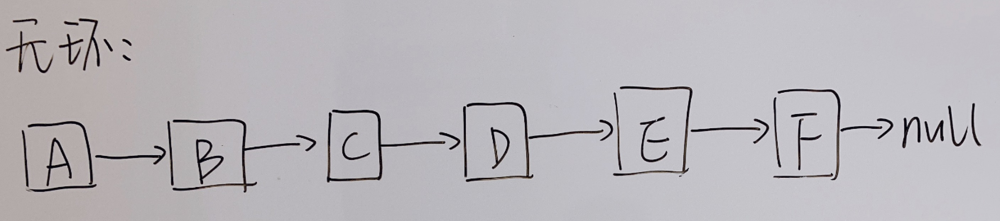
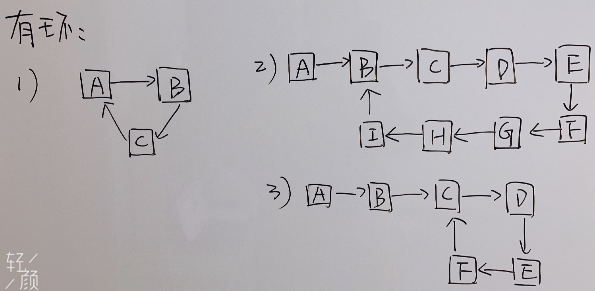
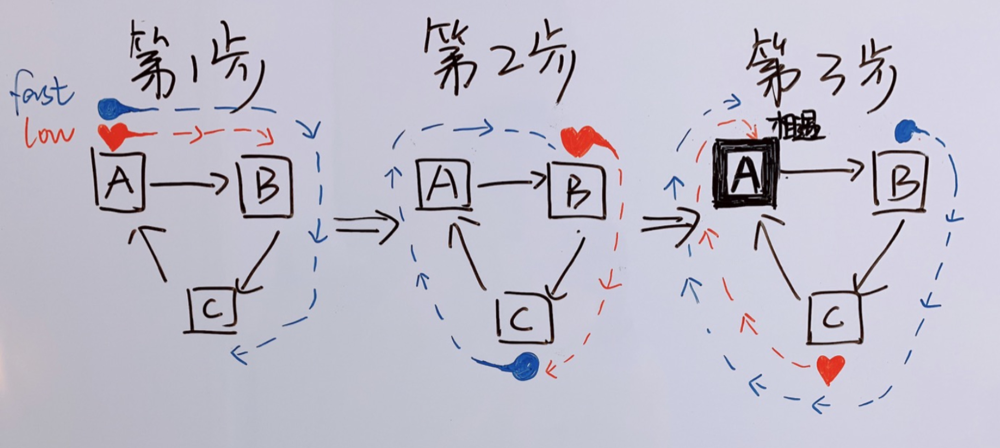
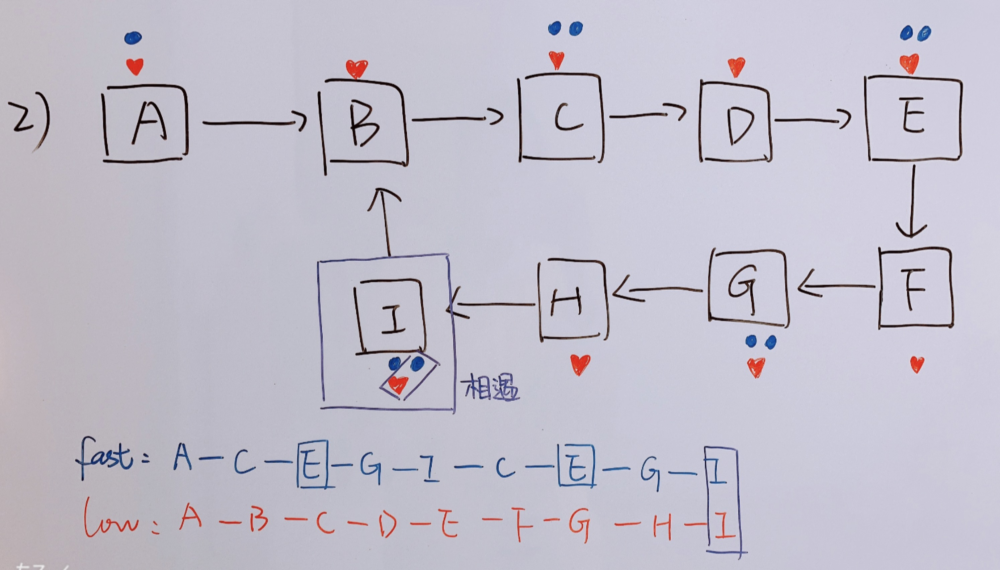
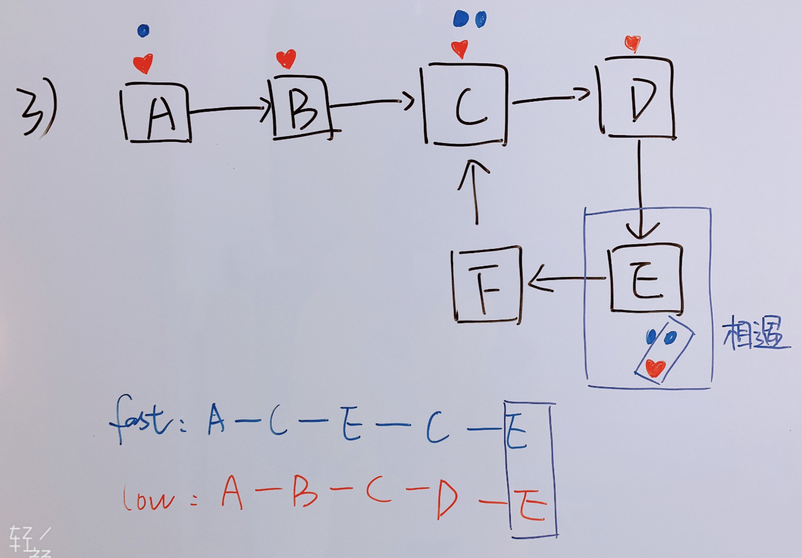

### 一、判断链表是否有环  
> - 英文版：[https://leetcode.com/problems/linked-list-cycle/](https://leetcode.com/problems/linked-list-cycle/)
> - 中文版：[https://leetcode-cn.com/problems/linked-list-cycle/](https://leetcode-cn.com/problems/linked-list-cycle/)

### 二、题意解析：

1、首先如果一个单链表没有环，最后一个结点指向null，如下图1所示：

2、但是如果一个链表有环，以下是我能想到有环的三种情况，如下图2所示：

  
### 三、简单描述前两种解法 

第一种，从上图1和图2可以看出，有环和无环的区别是最后一个结点是否指向null，如果指向null，表示无环，如果没有指向null，则有环

第二种，循环遍历链表，每经过一个结点，将结点的next指针存入Set集合，如果发现有重复的，则有环，否则无环

### 四、详细讲解最后一种解法

第三种，使用快慢指针来解答，快指针每次循环走两步，慢指针每次循环走一步，如果链表无环，像图1一样，是一条直线，快指针和慢指针同时出发，快指针又比慢指针走的快两倍，那慢指针和快指针永远都不会相遇
但是像图2，链表中有环，意味着快指针走着走着，会拐弯，进入环里，就意味着有机会和慢指针相遇。

#### 有环链表-示例1
图2中第一个简单的有环链表，蓝色圆圈fast代表快指针，红色小心心low代表慢指针，如图3所示：

1）第1步，fast和low从A结点同时出发，fast每次走两个结点，low每次走一个结点
2）第2步，fast经过A-B-C，走到C；low经过A-B，走到B
3）第3步，fast经过C-A-B，走到B；low经过B-C，走到C
然后fast继续经过B-C-A，low继续经过C-A，所以两个指针在A结点相遇，其中fast指针的路线A-B-C-A-B-C-A，low指针的路线A-B-C-A。

#### 有环链表-示例2
看图2中的第二个有环的链表，如下图4所示：(此处不再详细画出)

由上图4可以看出，fast指针在E结点处拐弯，两次经过E结点拐弯，最终在I结点和low相遇。

#### 有环链表-示例3
图2中第三个有环的链表，如下图5所示：

