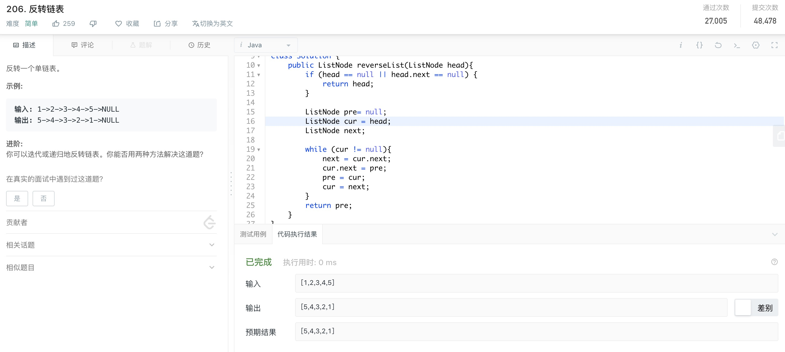
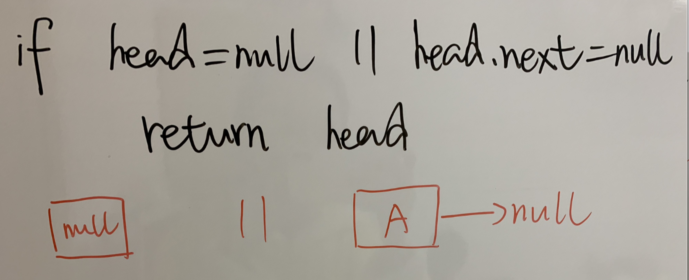
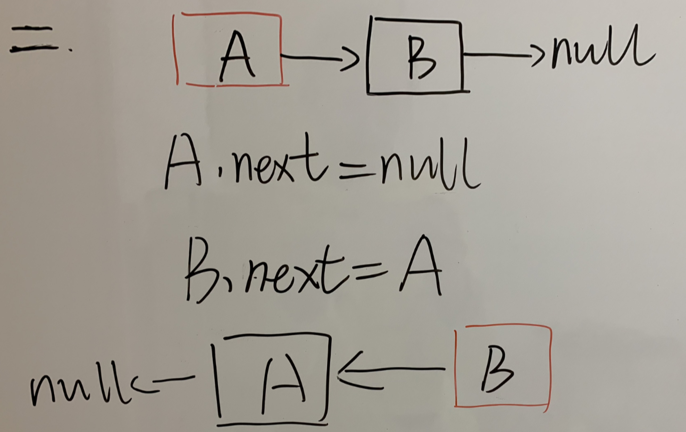
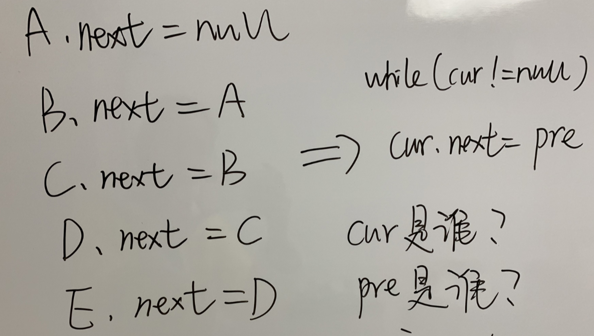

##  反转单链表
题意如下图：

重要提示leetCode里面传入的head结点，表示的不是数据结构里面的头结点，而是链表的第一个结点

### 单链表反转步骤 -- 迭代法

1）第一步，判断第一个结点head是否为空，如果为空，表示是个空链表，直接返回head（null），又或者head.next为空，表示链表只有一个结点，直接返回head

2）第二步，如果一个链表只有两个结点该怎么反转？那就是A结点变成最后一个结点，B结点变成第一个结点，所以A指向null，B指向A

3）第三步，如果有多个结点如何反转？

从图中可以看出，左侧的A->B->C->D->E，表示第一个结点到最后一个结点的走向，右侧的null->A->B->C->D，表示第一个结点前一个结点到最后一个结点前一个结点的走向，所以需要声明两个变量pre和cur：
> pre: 表示前一个结点，是一个变量，从null开始循环，
> cur: 表示当前结点，也是一个变量（），从head开始循环

> 注: 变量是指每次进入循环的值都是在变化的，所以是一个变量

4）第四步，反转指针之后，将指针陆续向后走一位，即pre走到cur，cur走到cur的下一个结点，但是事先没有声明cur的下一个结点是谁，cur就不知道该向哪里移动了，所以需要提前声明出cur的下一个结点next，
 ListNode next = cur.next;

### 总结
> 重点注意：反转单链表中迭代法的核心其实就四步：
> - 1.首先将存储当前结点的下一个结点next = cur.next
> - 2.然后反转指针，将指针指向前一个结点，cur.next = pre
> - 3.然后移动前结点到当前结点，pre = cur
> - 4.移动当前结点到下一个结点cur = next
 
其中步骤1的左边是next，右边是cur.next，意思是要将右边cur.next的值赋给左边的next变量，即核心是给等号左边的next结点赋值，

另外步骤2的左边是cur.next，右边是pre，意思是将右边pre的值（最开始是null）赋值给左边的指针cur.next，即核心是给等号左边的指针赋值

虽然步骤1和步骤2中都有cur.next，但是步骤1在右边，表示的是一个具体的值，赋给左边变量，而步骤2在左边，表示的是一个指针，是一个引用，将pre结点赋值给这个指针引用

