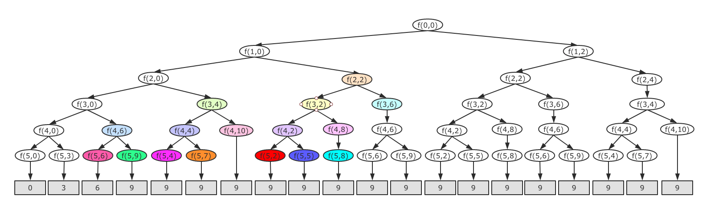
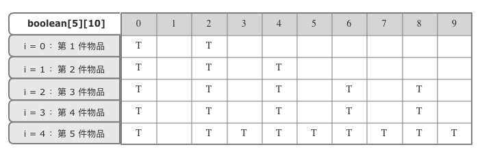

### 0-1 背包问题

01背包是非常经典的算法，很多场景可以抽象成问题模型，这个问题的经典解法是动态规划，不过，还有一种简单但是没那么高效的解法，就是回溯算法 + 记忆化递归。

### 问题描述

我们有一个背包，背包总的承载重量是 bw（backpack weight） kg，现在我们有 n 个物品，每个物品的重量不等，并且**不可分割**，我们现在期望选择几件物品，装在到背包中。在不超过背包所能装载重量的前提下，如何让背包的总重量最大？

注意：这里物品是不可分割的，要么装要么不装，所以叫 0 - 1 背包。

### 回溯 + 记忆化递归

对于每个物品来说，都有两个选择，装进背包或者不装进背包，那么 n 个物品，总的装法就有 2ⁿ 种，去掉总重量超过 bw kg 的，从剩下的装法中选择总重量嘴接近 bw kg 的。不过我们如何才能不重复的穷举出这 2ⁿ 种装法呢？

我们可以把物品依次排列，整个问题就分解成了 n 个阶段，每个阶段对应一个物品怎么选择，先对第一个物品进行处理，选择装进去或者不装进去，然后再递归的处理剩下的物品。

这里还稍微用了一点搜索剪枝的技巧，就是当发现已经选择的物品的重量超过 bw kg 的时候，停止继续下坠剩下的物品。

<div align="center"></div>

从上图递归树中可以发现，有些子问题重复，于是再加上记忆化递归，记录已经计算好的 f（i，curLoadSum）,下次再计算的时候直接取出，不用继续下坠。

```java
/**
     *
     * 解法1 回溯 + 记忆化递归
     *
     * @param i: 考察到哪个物品
     * @param curLoadSum: 当前已经装进去的物品的重量和
     * @param n：物品个数
     * @param bw：背包可承受重量
     */
    private void f(int i, int curLoadSum, int n, int bpWeight) {
        if (curLoadSum == bw || i == n) {//装满了或者物品全部考察完
            //if (curLoadSum > maxW) maxW = curLoadSum;
            maxW = Math.max(maxW, curLoadSum);
            return;
        }
        if (mem[i][curLoadSum]) return;
        mem[i][curLoadSum] = true;//记忆化递归存储
        f(i + 1, curLoadSum, n, bpWeight);//不装第 i 件物品
        if (curLoadSum + weights[i] <= bw)//若加上 i 件物品，小于背包承载重量，再继续装 (剪枝)
            f(i + 1, curLoadSum + weights[i], n, bpWeight);//装第 i 件物品
    }

```

### 动态规划

我们将整个求解过程分为 n 个阶段，每个阶段会决策一个物品是否放到背包中，每个物品决策完之后，背包中的物品的重量就会有多种情况，也就是说会达到多种不同状态。

用一个二维数组 s[n] [w + 1]，来记录每层可以达到的不同状态。第 0 个物品的重量是 2，要么装入背包，要么不装入背包，决策完会对应背包中的两种状态，分别用 s[0] [0] 和 s[0] [2] 来表示。

第一个物品的重量也是 2，基于第一件物品装完的状态，第二件物品装完之后会有 4 中状态，分别是：

-  0 不装 -1 不装：s[1] [0] 
-  0 不装 -1 装：s[1] [2] 
-  0 装 -1 不装：s[1] [2] 
-  0 装 -1 装：s[1] [4] 

去重之后就是 3 中状态：s[1] [0] 、s[1] [2] 、s[1] [4] 

以此类推，直到考察完所有物品。在最后一层找到一个值为 true 并且最接近 9 的值，就是背包中物品总重量的最大值。

<div align="center"></div>

```java
/**
     *
     * 解法2 动态规划
     *
     * @param n：物品个数
     * @param bw: 当前已经装进去的物品的重量和
     * @return 最大可以装多少重量
     */
    private int dpBackpack (int n, int bw) {
        boolean[][] s = new boolean[n][bw + 1];//初始化二维数组
        s[0][0] = true;//第一件物品不装
        if (weights[0] <= bw) s[0][weights[0]] = true;//第一件物品装
        for (int i = 1; i < n; i++) {
            for (int j = 0; j <= bw ; j++) {//选择不装 i 件物品
                if (s[i - 1][j]) s[i][j] = s[i - 1][j];
            }
            for (int j = 0; j <= bw - weights[i]; j++) {//选择装 i 件物品
                if (s[i - 1][j]) s[i][j + weights[i]] = true;
            }
        }

        for (int i = bw; i >= 0; i--) {//最后一层找到最大值
            if (s[n - 1][i]) return i;
        }
        return 0;
    }
```

代码更详细部分请点击： [01背包代码答案](https://github.com/gaoshengnan/LeetCode/blob/master/src/main/java/theoreticalBasis/%E8%83%8C%E5%8C%85/Backpack01.java)

